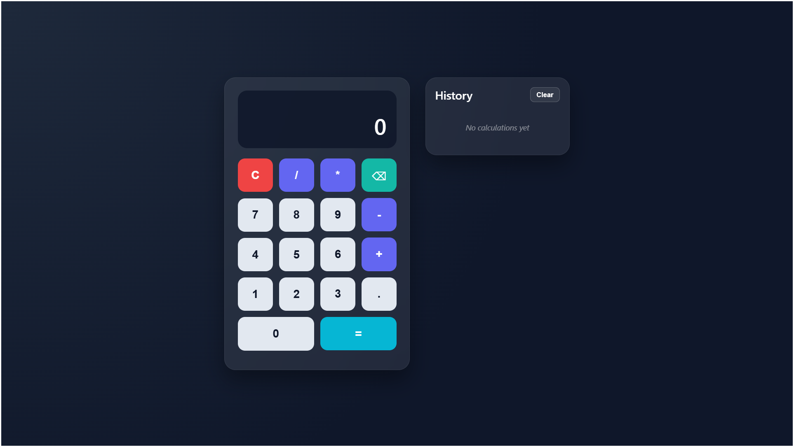

# 📱 Modern Calculator

A responsive calculator built with **HTML**, **CSS** and **vanilla JavaScript**. Glass-style UI, keyboard shortcuts, expression preview and a scrollable history panel.

---

## 🚀 Features

- Basic operations: add, subtract, multiply, divide
- Expression preview while you type
- Calculation history (last 25 entries) with clear button
- Keyboard support
- Divide-by-zero handling
- Mobile-friendly layout
- No build step or dependencies

---

## 🖇️ Demo

Open `index.html` in your browser, or use a local server:

```bash
# Python
python -m http.server 8080

# Node (npx)
npx serve .
```

Then visit `http://localhost:8080`.

---

## ⌨️ Keyboard shortcuts

| Key | Action |
|-----|--------|
| `0`–`9` | Enter digits |
| `+` `-` `*` `/` | Operators |
| `.` | Decimal point |
| `Enter` or `=` | Calculate |
| `Backspace` / `Delete` | Remove last digit |
| `C` or `Escape` | Clear all |

---

## 📁 Project structure

```
├── index.html
├── script.js
├── css/
│   ├── style.css
│   └── variable.css
└── README.md
```

---

## 🪪 License

MIT — use freely for learning and portfolio projects.

---

## 🔗 Live Demo 
[Check Live Demo here](https://modern-calculator-simple.netlify.app/)

---

## Screenshots
**Initial**


**Calculations**


---

## 🙎‍♂️ Author

**Muhammad Farhan**

